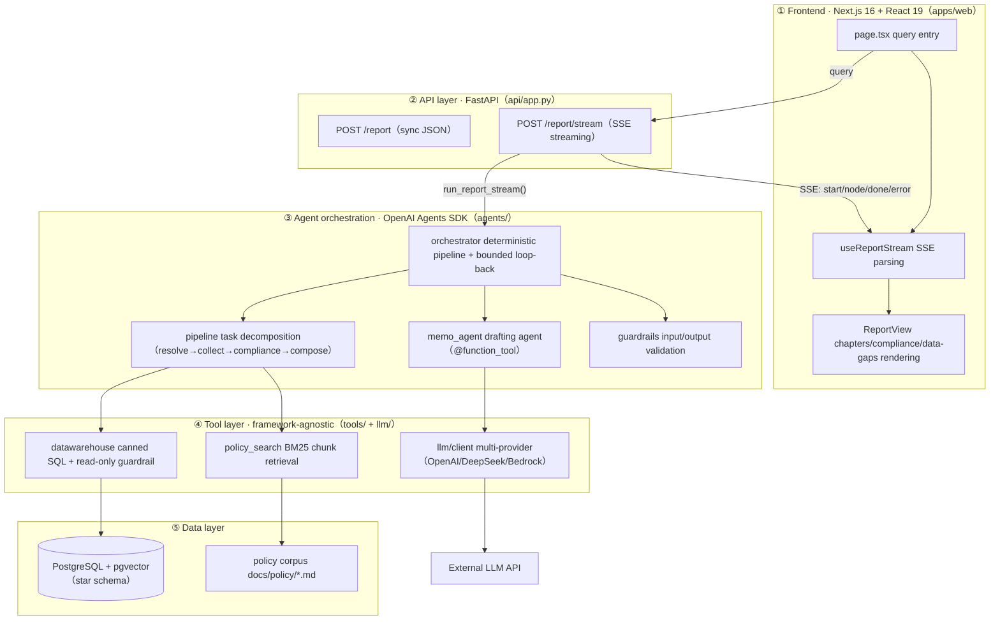

# Credit Copilot

A multi-tool AI agent for the **wholesale / corporate credit domain** (对公/批发信贷域). The first shipped scenario is **automated credit due-diligence report generation (credit memo, 授信尽调报告)**: given a single line like *"generate a credit memo for company X"*, the agent breaks the task down, pulls data across the data warehouse and policy documents, checks compliance, and writes a **structured report with citations**.

> A portfolio project for the transition from data-warehouse engineer to LLM-agent engineer.

## Why this scenario

Writing a credit memo today means an analyst hand-assembles ratings, facilities, exposure, guarantees, and compliance clauses across CARM / WREN / the data warehouse / policy documents — hours to days of work, and clauses are easy to miss. This is the highest-ROI agent scenario in the credit domain, already validated in production:

- **China Everbright Bank**: 100-page credit reports went from 7 days to 3 minutes, rolled out to 39 branches and ~2,000 relationship managers.
- **Bank of Hebei "冀银智脑"**: drafting went from 7 days to 10 minutes, cutting ~70% of the workload.
- **Moody's / Auquan / Evalueserve**: credit-memo automation reduces first-draft manual effort by 30–50%, saving 1–2 days per obligor.

This project proves out that core loop, and designs the **tool layer** as a reusable foundation for Q&A, reconciliation, and post-loan early-warning scenarios.

## Report structure (chapters = task-decomposition granularity)

| Chapter | Data source | Tool |
|---|---|---|
| 1. Borrower & Group Overview | `dim_borrower` + `dim_borrowing_group` | DB (deterministic query) |
| 2. Ratings | `fact_rating` (time-dimension SCD) | DB |
| 3. Credit Facilities | `dim_main_facility` + `dim_sub_facility` | DB |
| 4. Exposure & Limit Utilization | `fact_utilization` + group limits | DB |
| 5. Related Parties & Guarantees | `dim_involved_party` | DB |
| 6. Policy & Compliance Check | policy-document corpus | RAG |
| 7. Risk Points & Conclusion | above facts + compliance result | LLM synthesis (not a tool) |
| Data-gap declaration | — | validation layer (**never fabricates** missing data) |

## Four design principles → code

The four principles are the core capability this project demonstrates; each maps to concrete files and tests.

| Principle | Landing files | Key implementation | Tests |
|---|---|---|---|
| ① Task decomposition | [agents/orchestrator.py](apps/backend/src/credit_copilot/agents/orchestrator.py) / [agents/pipeline.py](apps/backend/src/credit_copilot/agents/pipeline.py) | **Deterministic pipeline** (plain Python orchestration), not free-form ReAct; the 7 chapters run in order `resolve_entity → collect_facts → compliance → compose_report → validate`, with `collect_facts` fanning out in parallel | [test_orchestrator.py](apps/backend/tests/test_orchestrator.py) / [test_credit_memo.py](apps/backend/tests/test_credit_memo.py) |
| ② Tool use | [tools/datawarehouse.py](apps/backend/src/credit_copilot/tools/datawarehouse.py) / [tools/policy_search.py](apps/backend/src/credit_copilot/tools/policy_search.py) / [agents/memo_agent.py](apps/backend/src/credit_copilot/agents/memo_agent.py) | **Explicit "what goes where"**: deterministic facts → DB (parameterized canned SQL; the LLM never writes free SQL); policy constraints → RAG (BM25 chunk retrieval); reasoning & prose → LLM. The agent side thinly wraps the same tools with `@function_tool` | [test_policy_search.py](apps/backend/tests/test_policy_search.py) |
| ③ Error handling | [tools/base.py](apps/backend/src/credit_copilot/tools/base.py) | Uniform `ToolResult` return; `with_retry` exponential backoff (transient errors only); `FatalError` never retried; DB layer sets `connect_timeout` + `statement_timeout`; **a failed chapter degrades gracefully instead of killing the whole report** | [test_tools_base.py](apps/backend/tests/test_tools_base.py) |
| ④ Result validation | [guardrails/sql_guard.py](apps/backend/src/credit_copilot/guardrails/sql_guard.py) + [agents/guardrails.py](apps/backend/src/credit_copilot/agents/guardrails.py) | Four gates: read-only SQL whitelist (before execution) → entity disambiguation (0 hits refuse / multi-hit list candidates — the equivalent of an input-guardrail tripwire) → numeric/completeness/citation validation (can loop back to compose) → output guardrail (conclusion length / non-empty) | [test_sql_guard.py](apps/backend/tests/test_sql_guard.py) / [test_agents_sdk.py](apps/backend/tests/test_agents_sdk.py) |

## Architecture

```
One line — "generate a credit memo for Huayu Electronics Group"
  → FastAPI /report/stream (SSE per-node progress)
    → orchestrator.run_report() (deterministic pipeline, Python orchestration)
        resolve_entity           entity disambiguation: 0 hits refuse / >1 hit list candidates (input guardrail)
        collect_facts            parallel fan-out fetch (DB tools + policy search)
        check_compliance         policy comparison → compliance flags
        compose_report           deterministic chapters 1–6 + Agents SDK writes chapter 7 (output guardrail)
        validate_report          four checks (fail → bounded loop back to compose_report)
    → tool layer (all return ToolResult)
        ├─ datawarehouse: canned SQL + read-only guardrail + timeouts
        ├─ policy_search: BM25 chunk retrieval + chunk citations
        └─ llm client: OpenAI / DeepSeek (compatible) / Bedrock (Claude) multi-provider + error classification
  → Next.js 16 frontend (SSE streaming progress + report)
```

> **Why "deterministic pipeline + Agents SDK" rather than "LangGraph DAG"?** The OpenAI Agents SDK has no DAG primitive — it is an agent-loop framework. Task decomposition is expressed as ordinary Python orchestration functions (which is also the better, more controllable approach); the SDK contributes `function_tool` / `input_guardrail` / `output_guardrail` / `Runner` / tracing. See [tech selection](#tech-stack) below.

## Engineering structure (工程结构图)

The whole chain is five layers; data flows one full loop along `query → SSE → report`. When reading code, use this diagram to locate "what this layer does and which layer it depends on".



- **Layer ③ (orchestration) is the project's heartbeat** (编排层是项目的心跳): all four principles land here — this is the core interview area for the transition.
- **Layer ④ (tool layer) is deliberately framework-agnostic** (工具层刻意框架无关): it imports nothing from the Agents SDK, so it can be reused verbatim for later T1 Q&A / T3 workflow-automation scenarios.
- The directory tree is under ["Monorepo structure"](#monorepo-structure) below; per-module responsibilities are under the backend / frontend module structures.

## Domain model (领域模型 — credit due-diligence basics)

> These are the core concepts a credit analyst reasons with. The "wholesale credit" domain (对公授信) centers on a **borrowing group** (借款集团, the risk-consolidation unit), its **borrowers** (借款人/债务人), their **credit facilities** (授信方案: main + sub facilities), **exposure & limit utilization** (敞口与限额使用), **guarantees / related parties** (担保与相关方), and **ratings** (评级, which gate access via policy lines like the **rating access threshold** 评级准入线).

| Table | Meaning |
|---|---|
| `dim_borrowing_group` | Borrowing group (借款集团 — risk-consolidation unit) |
| `dim_borrower` | Borrower / obligor (借款人/债务人) |
| `dim_main_facility` | Main facility (主额度 — Revolving/Term/Trade/Bridge) |
| `dim_sub_facility` | Sub-facility (子额度 — LC/Guarantee/Cash/Term/Aval) |
| `fact_rating` | Ratings (评级 — time-dimension SCD) |
| `dim_involved_party` | Related parties (相关方 — borrower/guarantor/agent/lead arranger) |
| `map_carm_wren` | Cross-system entity mapping (incl. unmatched — demonstrates the data-quality pain point) |
| `fact_utilization` | Facility utilization / exposure (额度使用/敞口 — monthly time dimension) |

## Quick start

```bash
# 0. Prerequisites: uv, Docker, Node 20+
cp apps/backend/.env.example apps/backend/.env   # fill in OPENAI_API_KEY (or LLM_API_KEY for a compatible endpoint)
make setup                    # install backend deps (uv)
make data                     # generate synthetic CSVs into apps/backend/data/seed/ (no DB needed)
make db-up                    # start Postgres + pgvector
make seed                     # generate + load

# 1. start the API
make run-api

# 2. start the frontend
make web-setup && make web-dev   # http://localhost:3000

# 3. sync report (JSON)
curl -s -X POST localhost:8000/report \
  -H 'Content-Type: application/json' \
  -d '{"query":"generate a credit memo for Huayu Software Services PLC"}'

# 4. streaming report (SSE, per-node progress)
curl -N -X POST localhost:8000/report/stream \
  -H 'Content-Type: application/json' \
  -d '{"query":"generate a credit memo for Huayu Software Services PLC"}'
```

> `Huayu Software Services PLC (华宇软件服务有限责任公司)` is a real seeded borrower (under `Huayu Electronics Group (华宇电子集团)`). Seeded groups include `Hengyuan Holdings Group (恒远控股集团)`, `Meridian Global Holdings (梅里迪安环球控股)`, `Atlas Energy Partners (阿特拉斯能源合伙)`, and `Vesta Pharma Ltd (维斯塔制药有限公司)` — see `apps/backend/data/generate_data.py`.
>
> Without an LLM key, the backend degrades to a "rule-based conclusion" and still produces a report (see the fallback branch in [agents/memo_agent.py](apps/backend/src/credit_copilot/agents/memo_agent.py)).

## Monorepo structure

```
credit-copilot/
├── apps/
│   ├── backend/                      # backend: FastAPI + OpenAI Agents SDK (uv)
│   │   ├── pyproject.toml / uv.lock
│   │   ├── .env.example
│   │   ├── data/generate_data.py     # synthetic data
│   │   ├── docs/policy/*.md          # policy corpus (RAG source)
│   │   ├── tests/                    # unit tests covering the four principles
│   │   └── src/credit_copilot/
│   │       ├── agents/               # Agents SDK orchestration (see module structure below)
│   │       ├── tools/                # framework-agnostic tools: DB / policy search / with_retry
│   │       ├── guardrails/           # SQL read-only whitelist
│   │       ├── llm/                  # multi-provider LLM client
│   │       ├── db/  config.py        # data access + config
│   │       └── api/app.py            # FastAPI /report, /report/stream
│   └── web/                          # frontend: Next.js 16 (npm)
│       ├── package.json / tsconfig.json / next.config.ts
│       └── src/
│           ├── app/                  # App Router (page / layout / providers)
│           ├── features/report/      # types + API client + SSE hook
│           ├── components/           # query form, report view
│           └── lib/                  # SSE parsing utility
├── turbo.json                        # unified task orchestration (dev/build/lint/test)
├── docker-compose.yml                # postgres (+ langfuse optional)
├── Makefile                          # unified entrypoint (backend + web targets)
└── README.md
```

### Backend module structure (agents/ orchestration layer)

```
apps/backend/src/credit_copilot/agents/
├── models.py          # Entity/Flag/Section/CreditMemo + chapter titles (no framework deps, independently testable)
├── pipeline.py        # deterministic pipeline: resolve_entity / collect_facts (parallel) / build_compliance_flags
├── memo_agent.py      # drafting agent + @function_tool registration + multi-provider model selection
├── guardrails.py      # @output_guardrail (conclusion non-empty / length cap)
└── orchestrator.py    # run_report(): explicit steps + bounded loop-back; run_report_stream(): SSE events
```

### Frontend module structure (Next.js 16 App Router)

```
apps/web/src/
├── app/                        # page.tsx (query page) + layout.tsx + providers.tsx (TanStack Query)
├── features/report/
│   ├── types.ts                # TS types aligned with the backend CreditMemo
│   ├── api.ts                  # typed API client (NEXT_PUBLIC_API_BASE_URL)
│   └── useReportStream.ts      # SSE parsing hook (node/done/error events)
├── components/                 # QueryForm / ReportView (chapter cards, compliance flags, data gaps)
└── lib/sse.ts                  # fetch + ReadableStream SSE parser (POST-compatible)
```

## Tech stack

The stack aligns with **mainstream Western teams** (欧美主流), so switching to remote work is seamless. Full rationale is in the [selection notes](#selection-notes) below.

| Layer | Choice | Notes |
|---|---|---|
| Agent orchestration | **OpenAI Agents SDK** (`openai-agents`) | Official; built-in `function_tool` / guardrails / tracing / Session; most token-efficient |
| Backend | **FastAPI + Pydantic v2 + uvicorn** | mainstream for AI products in 2026; SSE streaming |
| Frontend | **Next.js 16 (App Router, Turbopack) + React 19 + TS5 + Tailwind v4 + TanStack Query v5** | used by DoorDash/StockX/Zillow — strongest résumé signal |
| Data | **PostgreSQL 16 + pgvector + psycopg3 + SQLAlchemy 2.0** | consensus choice |
| Package mgmt | **uv (backend) + npm (frontend) + Turborepo (unified tasks)** | modern default |
| LLM provider | default **OpenAI**; DeepSeek/Tongyi/Zhipu via `OpenAIChatCompletionsModel(base_url=…)`; Claude via **AWS Bedrock** | OpenAI/Anthropic are the Western default; domestic-compatible too |
| Retrieval | BM25-lite (offline, zero-embedding-key fallback); stage 1 can add BGE-M3 vector pre-filter + rerank | — |
| Observability / eval | Agents SDK built-in tracing (for now); Langfuse / RAGAS + SQL golden set (stage 4) | — |

### Selection notes (为什么是这套)

- **OpenAI Agents SDK vs LangGraph**: LangGraph is the most "production-ready" graph-orchestration framework, but the Agents SDK is simpler, has guardrails/tracing built in, is the most token-efficient, and matches the OpenAI-first ecosystem. The trade-off is that it has no deterministic DAG primitive — this project keeps the deterministic flow in plain Python orchestration functions (see [Architecture](#architecture)), and the SDK only handles the LLM step and validation. It is also OpenAI-first, so Claude goes through Bedrock (that path is built in).
- **Next.js + FastAPI**: the mainstream front/back-end combo for AI products in 2026; connects straight to SSE with zero Node-BFF complexity.
- **Monorepo**: uv + npm + Turborepo is the modern Western-team default; the backend's absolute imports (`from credit_copilot…`) are unaffected by nesting, and the policy-corpus relative path `apps/backend/docs/policy` stays put.

## Learning path (学习建议 — data-warehouse engineer's transition)

> Your strengths are **data modeling / SQL / Python / ETL**; your gaps are **frontend (React/Next.js), backend web (FastAPI), and agent/LLM orchestration**. Start from the data layer you know best and expand outward layer by layer, pairing each with a "hands-on task" to prove you actually understand it.

| # | Layer | Corresponding code | What to learn | Hands-on check |
|---|---|---|---|---|
| ① | Data layer (your home turf) | `db/`, `data/generate_data.py`, star schema | mostly known; add **pgvector**, **SQLAlchemy 2.0** | add a `dim_industry` table in `generate_data.py` and run `make data` |
| ② | Tool layer | `tools/base.py`, `datawarehouse.py`, `policy_search.py` | `ToolResult` uniform return, `with_retry` idempotency/backoff, **BM25 chunk retrieval** | add a new canned-SQL tool to `datawarehouse` |
| ③ | Agent orchestration (the core transition) | `agents/` (orchestrator/pipeline/memo_agent/guardrails) | `@function_tool`, `@input/@output_guardrail`, `Runner`, **why a deterministic pipeline instead of free ReAct** | add a new `@function_tool` that chapter 7 can call |
| ④ | Backend web | `api/app.py` | FastAPI routes, Pydantic v2 validation, **SSE streaming** | add a `GET /report/{id}` (mock first, then wire to the query) |
| ⑤ | Frontend | `apps/web/` (page/hook/components) | React hooks, App Router, TanStack Query, **consuming SSE** | add "collapse/expand chapter" interaction to the report page |
| ⑥ | Engineering | `Makefile`, `turbo.json`, `pyproject.toml` | Monorepo, uv, Turborepo, type checking (mypy/ESLint) | run `make test-all`, read each target line by line |

**Suggested order**: ①② (play to your strengths, build confidence) → ③ (the core transition, invest most here) → ④⑤ (web skills, just enough) → ⑥ (engineering wrap-up).

**Three learning principles**:
- **Run first, then read**: "run it → change one thing → see the effect" beats pure code-reading; the [Quick start](#quick-start) already lays out the minimum loop.
- **Grasp the "why this design"**: when reading code, map against the "what goes where" of the four principles, and go back to the [selection notes](#selection-notes) to understand each trade-off — this is what interviews ask most.
- **Frontend is just-enough**: for the agent track, the frontend goal is "independently wire the backend capability into a usable UI"; don't sink into CSS engineering or complex interactions — keep the weight on ③.

## Roadmap

- [x] Stage 0 · Foundation & data (star schema + synthetic data + monorepo scaffold + Agents SDK orchestration)
- [~] Stage 1 · RAG pipeline (chunking + BM25 retrieval landed; hybrid vector + rerank pending)
- [~] Stage 2 · Text-to-SQL (report uses canned SQL landed; free Text-to-SQL deferred to T1 Q&A)
- [~] Stage 3 · Agent orchestration (first scenario — credit-memo pipeline + guardrails + API + frontend landed; T1 Q&A router, T3 workflow automation pending)
- [ ] Stage 4 · Evaluation & observability (RAGAS + SQL golden set + Langfuse)
- [ ] Stage 5 · Enterprise abstraction (DataSource/DocumentSource interfaces + docs)

### Scenario blueprint (one tool layer, reused)

| Tier | Scenario | Status |
|---|---|---|
| T2 report ★ primary | **Credit memo generation** | ✅ shipped |
| T2 report | Group exposure & concentration monthly / rating migration analysis | pending |
| T1 Q&A | One-line Q&A (rating / facility / exposure / policy) | pending |
| T3 workflow automation | Cross-system reconciliation / post-loan early warning / maturity reminders | pending |

## Boundaries & notes

- **Financial-analysis chapter**: the current data model has no financial statements, so the report explicitly declares "no financial data / manual supplement required" in `data_gaps` — itself a positive demo of result validation that refuses to fabricate. To fill it in, extend a `fact_financial` table + financial-PDF parsing.
- **Industry analysis**: for now it stands in via the industry-access descriptions in the policy documents; external industry-library dependency deferred.
- **OpenAI-first trade-off**: the Agents SDK defaults to the OpenAI endpoint; Claude connects via Bedrock directly (not through the SDK), and domestic-compatible endpoints go through `OpenAIChatCompletionsModel` with tracing disabled.
- **DB migrations**: the current setup builds tables via `schema.sql`; Alembic migrations are deferred to a later hardening pass (stage 5).
- **Borrower vs group scope**: the full seven-chapter report is written for a **borrower**. Resolving a **group** still works, but its "Credit Facilities" and "Related Parties & Guarantees" chapters report "No data" (those facts are borrower-scoped in the current model), so the citation-coverage validator appends a "Validation Failed" section — a correct demonstration of result validation, not a crash. Use a borrower (e.g. the examples above) for a clean full report.
