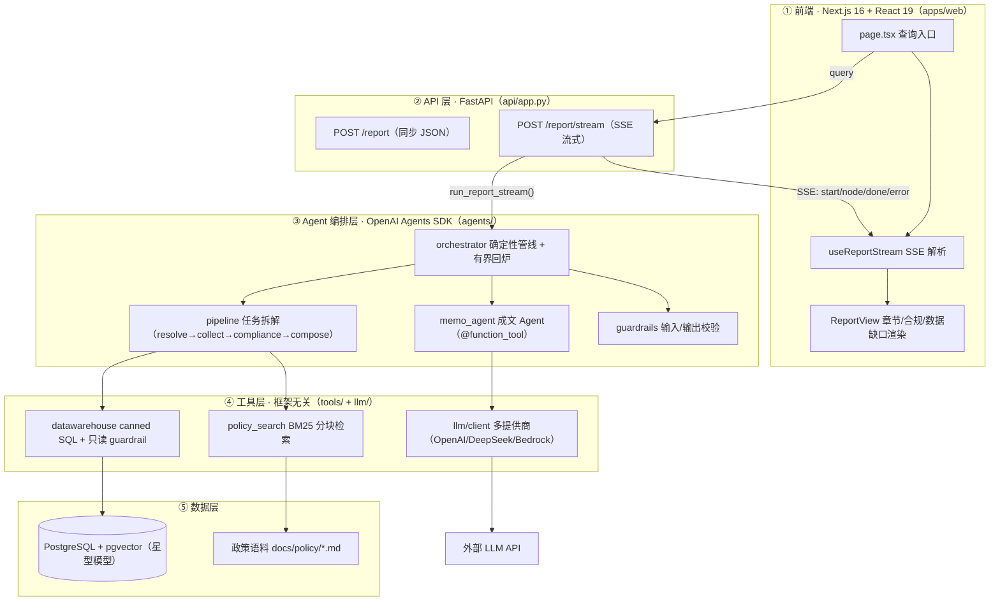

# 信贷分析师 Copilot（Credit Analyst Copilot）

面向**对公/批发信贷域**的多工具 AI Agent。首个落地场景是**授信尽调报告自动生成（Credit Memo）**：输入一句「生成『××公司』的授信尽调报告」，Agent 自动拆解任务、跨数仓 + 政策文档取数、核验合规、成文，输出一份**带引用/出处**的结构化报告。

> 传统数仓工程师 → 大模型 Agent 开发工程师 转型作品集项目。

## 为什么做这个场景

分析师写一份授信尽调报告，要横跨 CARM / WREN / 数仓 / 政策文档手工拼装评级、额度、敞口、担保与合规条款，耗时数小时~数天、易漏条款。行业已验证这是信贷域 ROI 最明确的 Agent 场景：

- **光大银行**：传统百页授信报告 7 天 → 3 分钟，已推广 39 家分行、近 2000 名客户经理。
- **河北银行「冀银智脑」**：撰写 7 天 → 10 分钟，减轻 70% 工作量。
- **Moody's / Auquan / Evalueserve**：credit memo 自动化，首稿人工量减 30–50%，单户省 1–2 天。

本项目把这条主线做通，并把这套**工具层**设计成可复用到问答、对账、贷后预警等场景的底座。

## 报告结构（章节 = 任务拆解的粒度）

| 章节 | 数据来源 | 工具 |
|---|---|---|
| 1. 借款人及集团概况 | `dim_borrower` + `dim_borrowing_group` | DB（确定性查询） |
| 2. 评级情况 | `fact_rating`（时间维 SCD） | DB |
| 3. 授信方案 | `dim_main_facility` + `dim_sub_facility` | DB |
| 4. 敞口与限额使用 | `fact_utilization` + 集团限额 | DB |
| 5. 相关方与担保结构 | `dim_involved_party` | DB |
| 6. 政策合规核验 | 政策文档语料 | RAG |
| 7. 风险点与结论 | 上述事实 + 合规结论 | LLM 合成（非工具） |
| 数据缺口声明 | —— | 校验层（**不编造**缺失数据） |

## 四大设计原则 → 代码落点

四原则是本项目要展示的核心能力，每一条都对应到具体文件与测试：

| 设计原则 | 落点文件 | 关键实现 | 测试 |
|---|---|---|---|
| ① 任务拆解 | [agents/orchestrator.py](apps/backend/src/credit_copilot/agents/orchestrator.py) / [agents/pipeline.py](apps/backend/src/credit_copilot/agents/pipeline.py) | 用**确定性管线**（Python 编排函数）而非自由 ReAct；7 章节按 `resolve_entity → collect_facts → compliance → compose_report → validate` 顺序执行，`collect_facts` 并行 fan-out | [test_orchestrator.py](apps/backend/tests/test_orchestrator.py) / [test_credit_memo.py](apps/backend/tests/test_credit_memo.py) |
| ② 工具调用 | [tools/datawarehouse.py](apps/backend/src/credit_copilot/tools/datawarehouse.py) / [tools/policy_search.py](apps/backend/src/credit_copilot/tools/policy_search.py) / [agents/memo_agent.py](apps/backend/src/credit_copilot/agents/memo_agent.py) | **明确"什么交给什么"**：确定性事实 → DB（参数化 canned SQL，不让 LLM 自由写 SQL）；政策约束 → RAG（BM25 分块检索）；推理成文 → LLM。Agent 侧用 `@function_tool` 薄封装同一套工具 | [test_policy_search.py](apps/backend/tests/test_policy_search.py) |
| ③ 异常处理 | [tools/base.py](apps/backend/src/credit_copilot/tools/base.py) | 统一 `ToolResult` 返回；`with_retry` 指数退避（仅瞬态错误重试）；`FatalError` 不重试；DB 层 `connect_timeout` + `statement_timeout`；**单章失败降级、不击穿整份报告** | [test_tools_base.py](apps/backend/tests/test_tools_base.py) |
| ④ 结果校验 | [guardrails/sql_guard.py](apps/backend/src/credit_copilot/guardrails/sql_guard.py) + [agents/guardrails.py](apps/backend/src/credit_copilot/agents/guardrails.py) | 四道关卡：SQL 只读白名单（执行前）→ 实体消歧（0 命中拒答 / 多命中列候选，等价 input guardrail tripwire）→ 数值/完整性/引用校验（可回炉成文）→ 输出 guardrail（结论长度/非空） | [test_sql_guard.py](apps/backend/tests/test_sql_guard.py) / [test_agents_sdk.py](apps/backend/tests/test_agents_sdk.py) |

## 架构

```
一句「生成『恒远汽车零部件』的授信尽调报告」
  → FastAPI /report/stream (SSE 逐节点进度)
    → orchestrator.run_report()（确定性管线，Python 编排）
        resolve_entity           实体消歧：0命中拒答 / >1命中列候选（input guardrail）
        collect_facts            并行 fan-out 取数（DB 工具 + 政策检索）
        check_compliance         政策比对 → 合规 flag
        compose_report           确定性拼 1-6 章 + Agents SDK 生成第7章结论（output guardrail）
        validate_report          四道校验（不过 → 有界回炉 compose_report）
    → 工具层（全部返回 ToolResult）
        ├─ datawarehouse：canned SQL + 只读 guardrail + 超时
        ├─ policy_search：BM25 分块检索 + chunk 引用
        └─ llm client：OpenAI / DeepSeek(兼容) / Bedrock(Claude) 多提供商 + 异常分类
  → Next.js 16 前端（SSE 流式渲染进度 + 报告）
```

> **为什么是「确定性管线 + Agents SDK」而非「LangGraph DAG」？** OpenAI Agents SDK 没有 DAG 原语，它是 agent-loop 框架。任务拆解用普通 Python 编排函数表达（这本身是更优、更可控的做法），SDK 贡献 `function_tool` / `input_guardrail` / `output_guardrail` / `Runner` / tracing。详见[阶段0技术选型](#技术栈)。

## 工程结构图

整条链路分五层，数据沿 `query → SSE → 报告` 走一圈。读代码时对照此图定位「这一层在做什么、依赖哪一层」：



- **③ 编排层是项目的心跳**：四原则全部落在这里，是转型面试的核心考点。
- **④ 工具层刻意「框架无关」**：不 import Agents SDK，可原样复用到后续 T1 问答 / T3 流程自动化。
- 目录树见上方「项目工程结构（Monorepo）」，各模块职责见「后端模块结构」「前端模块结构」。

## 领域模型

| 表 | 含义 |
|---|---|
| `dim_borrowing_group` | 借款集团（风险合并单元） |
| `dim_borrower` | 借款人/债务人 |
| `dim_main_facility` | 主额度（Revolving/Term/Trade/Bridge） |
| `dim_sub_facility` | 子额度（LC/Guarantee/Cash/Term/Aval） |
| `fact_rating` | 评级（时间维 SCD） |
| `dim_involved_party` | 相关方（借款人/担保人/代理行/牵头行） |
| `map_carm_wren` | 跨系统实体映射（含未匹配，演示数据质量痛点） |
| `fact_utilization` | 额度使用/敞口（月度时间维） |

## 快速开始

```bash
# 0. 前置：uv、Docker、Node 20+
cp apps/backend/.env.example apps/backend/.env   # 填入 OPENAI_API_KEY（或 LLM_API_KEY 走兼容端点）
make setup                    # 安装后端依赖（uv）
make data                     # 生成合成 CSV 到 apps/backend/data/seed/（无需数据库）
make db-up                    # 启动 Postgres+pgvector
make seed                     # 生成 + 灌库

# 1. 起 API
make run-api

# 2. 起前端
make web-setup && make web-dev   # http://localhost:3000

# 3. 同步生成报告（JSON）
curl -s -X POST localhost:8000/report \
  -H 'Content-Type: application/json' \
  -d '{"query":"生成『恒远汽车零部件有限公司』的授信尽调报告"}'

# 4. 流式生成（SSE，逐节点进度）
curl -N -X POST localhost:8000/report/stream \
  -H 'Content-Type: application/json' \
  -d '{"query":"生成『恒远汽车零部件有限公司』的授信尽调报告"}'
```

> 无 LLM key 时后端自动降级为「规则结论」仍可产出报告（见 [agents/memo_agent.py](apps/backend/src/credit_copilot/agents/memo_agent.py) 的 fallback 分支）。

## 项目工程结构（Monorepo）

```
credit-copilot/
├── apps/
│   ├── backend/                      # 后端：FastAPI + OpenAI Agents SDK（uv 管理）
│   │   ├── pyproject.toml / uv.lock
│   │   ├── .env.example
│   │   ├── data/generate_data.py     # 合成数据
│   │   ├── docs/policy/*.md          # 政策语料（RAG 依据）
│   │   ├── tests/                    # 30 个单测，覆盖四原则
│   │   └── src/credit_copilot/
│   │       ├── agents/               # Agents SDK 编排层（见下方模块结构）
│   │       ├── tools/                # 框架无关工具：DB / 政策检索 / with_retry
│   │       ├── guardrails/           # SQL 只读白名单
│   │       ├── llm/                  # 多提供商 LLM 客户端
│   │       ├── db/  config.py        # 数据访问 + 配置
│   │       └── api/app.py            # FastAPI /report、/report/stream
│   └── web/                          # 前端：Next.js 16（npm 管理）
│       ├── package.json / tsconfig.json / next.config.ts
│       └── src/
│           ├── app/                  # App Router（page / layout / providers）
│           ├── features/report/      # 类型 + API client + SSE hook
│           ├── components/           # 查询框、报告视图
│           └── lib/                  # SSE 解析工具
├── turbo.json                        # 统一任务编排（dev/build/lint/test）
├── docker-compose.yml                # postgres（+ langfuse 可选）
├── Makefile                          # 统一入口（backend + web 目标）
└── README.md
```

### 后端模块结构（agents/ 编排层）

```
apps/backend/src/credit_copilot/agents/
├── models.py          # Entity/Flag/Section/CreditMemo + 章节标题（无框架依赖，可独立测试）
├── pipeline.py        # 确定性管线：resolve_entity / collect_facts(并行) / build_compliance_flags
├── memo_agent.py      # 成文 Agent + @function_tool 注册 + 多提供商模型选择
├── guardrails.py      # @output_guardrail（结论非空/长度上限）
└── orchestrator.py    # run_report()：显式步骤 + 有界回炉；run_report_stream()：SSE 事件
```

### 前端模块结构（Next.js 16 App Router）

```
apps/web/src/
├── app/                        # page.tsx（查询页）+ layout.tsx + providers.tsx（TanStack Query）
├── features/report/
│   ├── types.ts                # 与后端 CreditMemo 对齐的 TS 类型
│   ├── api.ts                  # 类型化 API client（NEXT_PUBLIC_API_BASE_URL）
│   └── useReportStream.ts      # SSE 解析 hook（node/done/error 事件）
├── components/                 # QueryForm / ReportView（章节卡片、合规 flag、数据缺口）
└── lib/sse.ts                  # fetch + ReadableStream 的 SSE 解析器（POST 兼容）
```

## 技术栈

技术选型对齐**欧美主流**（便于远程工作无缝切换），完整选型依据见下方「选型说明」。

| 层 | 选型 | 说明 |
|---|---|---|
| Agent 编排 | **OpenAI Agents SDK**（`openai-agents`） | 官方，内置 `function_tool` / guardrails / tracing / Session，token 效率最高 |
| 后端 | **FastAPI + Pydantic v2 + uvicorn** | AI 产品 2026 主流；SSE 流式 |
| 前端 | **Next.js 16（App Router, Turbopack）+ React 19 + TS5 + Tailwind v4 + TanStack Query v5** | DoorDash/StockX/Zillow 在用，简历信号最强 |
| 数据 | **PostgreSQL 16 + pgvector + psycopg3 + SQLAlchemy 2.0** | 共识选择 |
| 包管理 | **uv（后端）+ npm（前端）+ Turborepo（统一任务）** | 现代默认 |
| LLM 提供商 | 默认 **OpenAI**；DeepSeek/通义/智谱走 `OpenAIChatCompletionsModel(base_url=…)`；Claude 走 **AWS Bedrock** | 欧美默认 OpenAI/Anthropic，兼容国内 |
| 检索 | BM25-lite（离线、零 embedding key 降级），阶段1 可叠 BGE-M3 向量初筛 + 重排 | —— |
| 可观测/评估 | Agents SDK 内置 tracing（暂）；Langfuse / RAGAS + SQL 黄金集（阶段4） | —— |

### 选型说明（为什么是这套）

- **OpenAI Agents SDK vs LangGraph**：LangGraph 是「最 production-ready」的图编排框架，但 Agents SDK 更简洁、guardrails/tracing 内置、token 效率最高，且与 OpenAI-first 生态一致。代价是它没有确定性 DAG 原语——本项目把确定性流程保留在 Python 编排函数里（见[架构](#架构)），SDK 只负责 LLM 步与校验。同时它是 OpenAI-first，用 Claude 需经 Bedrock（本项目已内置该路径）。
- **Next.js + FastAPI**：2026 年 AI 产品的主流前后端组合，直连 SSE、零 Node BFF 复杂度。
- **Monorepo**：uv + npm + Turborepo 是现代欧美团队默认；后端绝对导入 `from credit_copilot…` 不受层级影响，`apps/backend/docs/policy` 的语料相对路径保持不变。

## 学习建议（数仓工程师转型路径）

> 你的优势在**数据建模 / SQL / Python / ETL**，薄弱在**前端（React/Next.js）、后端 Web（FastAPI）、Agent/LLM 编排**。建议**从你最熟的数据层读起，逐层向外扩**，每层配一个「动手实操」检验是否真懂。

| # | 层 | 对应代码 | 你要补的知识 | 动手实操（检验） |
|---|---|---|---|---|
| ① | 数据层（你的主场） | `db/`、`data/generate_data.py`、星型模型 | 基本都会；新增 **pgvector**、**SQLAlchemy 2.0** | 在 `generate_data.py` 加一个 `dim_industry` 表，跑通 `make data` |
| ② | 工具层 | `tools/base.py`、`datawarehouse.py`、`policy_search.py` | `ToolResult` 统一返回、`with_retry` 幂等/退避、**BM25 分块检索** | 给 `datawarehouse` 新增一条 canned SQL 工具 |
| ③ | Agent 编排（转型核心） | `agents/`（orchestrator/pipeline/memo_agent/guardrails） | `@function_tool`、`@input/@output_guardrail`、`Runner`、**为什么确定性管线而非自由 ReAct** | 新增一个 `@function_tool`，让第7章结论能调用它 |
| ④ | 后端 Web | `api/app.py` | FastAPI 路由、Pydantic v2 校验、**SSE 流式** | 加一个 `GET /report/{id}`（先 mock，再接通查询） |
| ⑤ | 前端 | `apps/web/`（page/hook/components） | React hooks、App Router、TanStack Query、**消费 SSE** | 给报告页加「章节折叠/展开」交互 |
| ⑥ | 工程化 | `Makefile`、`turbo.json`、`pyproject.toml` | Monorepo、uv、Turborepo、类型检查（mypy/ESLint） | 跑通 `make test-all`，逐行读懂每个 target |

**建议顺序**：①②（发挥优势、建立信心）→ ③（核心转型点，重点投入）→ ④⑤（Web 技能，够用即可）→ ⑥（工程化收尾）。

**三条学习原则**：
- **先跑通、再读码**：每个模块都「跑起来 → 改一处 → 看效果」，比纯读代码快得多；[快速开始](#快速开始)已把最小闭环铺好。
- **抓「为什么这样设计」**：读码时对照「四大设计原则」的「什么交给什么」，并回到[技术栈](#技术栈)「选型说明」理解每个选型的取舍——这是面试里最常被问到的点。
- **前端够用即可**：对 Agent 方向，前端目标是「能独立把后端能力接出一个可用 UI」，不必深挖 CSS 工程与复杂交互；重心留在 ③。

## 路线图

- [x] 阶段0 · 地基与数据（星型模型 + 合成数据 + Monorepo 脚手架 + Agents SDK 编排）
- [~] 阶段1 · RAG 管线（分块 + BM25 检索已落地；hybrid 向量 + rerank 待补）
- [~] 阶段2 · Text-to-SQL（报告走 canned SQL 已落地；自由 Text-to-SQL 留给 T1 问答）
- [~] 阶段3 · Agent 编排（首个场景「授信尽调报告」管线 + Guardrails + API + 前端已落地；T1 问答 Router、T3 流程自动化待做）
- [ ] 阶段4 · 评估与可观测（RAGAS + SQL 黄金集 + Langfuse）
- [ ] 阶段5 · 企业化抽象（DataSource/DocumentSource 接口 + 文档）

### 场景蓝图（同一套工具层可复用）

| 层级 | 场景 | 状态 |
|---|---|---|
| T2 报告 ★主攻 | **授信尽调报告生成** | ✅ 已实现 |
| T2 报告 | 集团敞口与集中度月报 / 评级迁移分析 | 待做 |
| T1 问答 | 一句话问答（评级/额度/敞口/政策） | 待做 |
| T3 流程自动化 | 跨系统对账 / 贷后预警 / 到期提醒 | 待做 |

## 边界说明

- **财务分析章节**：当前数据模型无财务报表，报告以 `data_gaps` 显式声明「无财务数据/待补充」——这本身是**结果校验不编造**的正面演示；如需补全，扩展 `fact_financial` 表 + 财报 PDF 解析。
- **行业分析**：暂以政策文档中的行业准入描述代替，依赖外部行业库的部分留待后续。
- **OpenAI-first 取舍**：Agents SDK 默认走 OpenAI 端点；Claude 经 Bedrock 直连（不走 SDK），国内兼容端点走 `OpenAIChatCompletionsModel` 并关闭 tracing。
- **数据库迁移**：当前用 `schema.sql` 建表，Alembic 迁移列入后续硬化（阶段5）。
