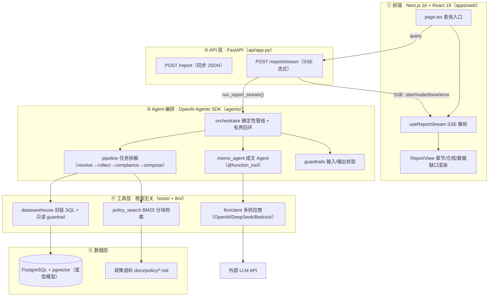

# Credit Copilot

[English](./README.md) · [简体中文](./README.zh-CN.md)

一个面向**对公 / 批发信贷域**（wholesale / corporate credit）的多工具 AI Agent。第一个落地的场景是**授信尽调报告的自动化生成**（credit memo）：给定一句话，例如 *"generate a credit memo for company X"*，Agent 会把任务拆解，从数据仓库和政策文档中拉取数据，核验合规性，最终产出一份**带引用的结构化报告**。

> 这是一个用于「数仓工程师 → LLM Agent 开发工程师」转型的作品集项目。

📄 **业务规则**: [docs/business-rules.md](docs/business-rules.md) — 每个业务实体的含义、合规流程、政策语料与报告结构。

## 为什么选这个场景

今天，写一份授信尽调报告意味着分析员要在 CARM / WREN / 数据仓库 / 政策文档之间手工拼装评级、授信额度、敞口、担保和合规条款——需要数小时到数天的工作量，且条款极易遗漏。这是信贷领域 ROI 最高的 Agent 场景，且已在生产环境得到验证：

- **中国光大银行**：100 页的信贷报告从 7 天缩短到 3 分钟，推广到 39 家分行、约 2000 名客户经理。
- **河北银行「冀银智脑」**：报告起草从 7 天缩短到 10 分钟，削减约 70% 的工作量。
- **Moody's / Auquan / Evalueserve**：授信尽调自动化把首稿人工工作量降低 30–50%，每个借款人节省 1–2 天。

本项目跑通了这条核心链路，并把**工具层**设计成可复用的底座，可支撑问答、对账、贷后预警等后续场景。

## 报告结构（章节 = 任务拆解的粒度）

| 章节 | 数据来源 | 工具 |
|---|---|---|
| 1. 借款人及集团概况 | `dim_borrower` + `dim_borrowing_group` | DB（确定性查询） |
| 2. 评级情况 | `fact_rating`（时间维度 SCD） | DB |
| 3. 授信方案 | `dim_main_facility` + `dim_sub_facility` | DB |
| 4. 敞口与限额使用 | `fact_utilization` + 集团限额 | DB |
| 5. 相关方与担保结构 | `dim_involved_party` | DB |
| 6. 政策合规核验 | 政策文档语料 | RAG |
| 7. 风险点与结论 | 上述事实 + 合规结果 | LLM 合成（非工具） |
| 数据缺口声明 | — | 校验层（**绝不编造**缺失数据） |

## 四条设计原则 → 代码

这四条原则是本项目要展示的核心能力；每一条都对应到具体的文件和测试。

| 原则 | 落点文件 | 关键实现 | 测试 |
|---|---|---|---|
| ① 任务拆解 | [agents/orchestrator.py](apps/backend/src/credit_copilot/agents/orchestrator.py) / [agents/pipeline.py](apps/backend/src/credit_copilot/agents/pipeline.py) | **确定性管线**（普通 Python 编排），而非自由形态的 ReAct；7 个章节按 `resolve_entity → collect_facts → compliance → compose_report → validate` 顺序执行，其中 `collect_facts` 并行展开 | [test_orchestrator.py](apps/backend/tests/test_orchestrator.py) / [test_credit_memo.py](apps/backend/tests/test_credit_memo.py) |
| ② 工具使用 | [tools/datawarehouse.py](apps/backend/src/credit_copilot/tools/datawarehouse.py) / [tools/policy_search.py](apps/backend/src/credit_copilot/tools/policy_search.py) / [agents/memo_agent.py](apps/backend/src/credit_copilot/agents/memo_agent.py) | **显式「什么该放哪里」**：确定性事实 → DB（参数化封装 SQL；LLM 绝不写自由 SQL）；政策约束 → RAG（BM25 分块检索）；推理与成文 → LLM。Agent 侧只是用 `@function_tool` 薄薄包一层同样的工具 | [test_policy_search.py](apps/backend/tests/test_policy_search.py) |
| ③ 错误处理 | [tools/base.py](apps/backend/src/credit_copilot/tools/base.py) | 统一的 `ToolResult` 返回；`with_retry` 指数退避（仅限瞬时错误）；`FatalError` 永不重试；DB 层设置 `connect_timeout` + `statement_timeout`；**某章节失败时优雅降级，而不是拖垮整份报告** | [test_tools_base.py](apps/backend/tests/test_tools_base.py) |
| ④ 结果校验 | [guardrails/sql_guard.py](apps/backend/src/credit_copilot/guardrails/sql_guard.py) + [agents/guardrails.py](apps/backend/src/credit_copilot/agents/guardrails.py) | 四道闸门：只读 SQL 白名单（执行前）→ 实体消歧（0 命中拒绝 / 多命中列出候选——等价于输入 guardrail 的绊线）→ 数值 / 完整性 / 引用校验（可回环到 compose）→ 输出 guardrail（结论长度 / 非空） | [test_sql_guard.py](apps/backend/tests/test_sql_guard.py) / [test_agents_sdk.py](apps/backend/tests/test_agents_sdk.py) |

<a id="architecture"></a>
## 架构

```
一句话 — "generate a credit memo for Huayu Electronics Group"
  → FastAPI /report/stream（SSE 逐节点进度）
    → orchestrator.run_report()（确定性管线，Python 编排）
        resolve_entity           实体消歧：0 命中拒绝 / >1 命中列出候选（输入 guardrail）
        collect_facts            并行展开取数（DB 工具 + 政策检索）
        check_compliance         政策比对 → 合规 flag
        compose_report           确定性章节 1–6 + Agents SDK 写第 7 章（输出 guardrail）
        validate_report          四道校验（失败 → 有界回环到 compose_report）
    → 工具层（均返回 ToolResult）
        ├─ datawarehouse：封装 SQL + 只读 guardrail + 超时
        ├─ policy_search：BM25 分块检索 + 分块引用
        └─ llm client：OpenAI / DeepSeek（兼容）/ Bedrock（Claude）多供应商 + 错误分类
  → Next.js 16 前端（SSE 流式进度 + 报告）
```

> **为什么是「确定性管线 + Agents SDK」而不是「LangGraph DAG」？** OpenAI Agents SDK 没有 DAG 原语——它是一个 Agent 循环框架。任务拆解被表达为普通的 Python 编排函数（这也是更好、更可控的做法）；SDK 贡献了 `function_tool` / `input_guardrail` / `output_guardrail` / `Runner` / tracing。详见下方[技术选型](#tech-stack)。

## 工程结构图

整条链路共五层，数据沿 `query → SSE → report` 走完一整圈。读代码时，用这张图来定位「这一层做什么、依赖哪一层」。



- **第 ③ 层（编排层）是项目的心跳**：四条原则全部落在这里——这也是转型面试中最核心的考察区。
- **第 ④ 层（工具层）刻意保持框架无关**：它不 import Agents SDK 的任何东西，因此可以原封不动复用于后续的 T1 问答 / T3 流程自动化场景。
- 目录树见下方 [Monorepo 结构](#monorepo-structure)；各模块职责见后端 / 前端模块结构。

## 领域模型 — 信贷尽调基础

> 这些是信贷分析员推理时用的核心概念。「对公授信」域围绕**借款集团**（风险合并口径）、其下的**借款人**（债务人）、它们的**授信方案**（主额度 + 子额度）、**敞口与限额使用**、**担保与相关方**，以及**评级**（评级通过如**评级准入线**这类政策线来把关准入）。

| 表 | 含义 |
|---|---|
| `dim_borrowing_group` | 借款集团（风险合并口径） |
| `dim_borrower` | 借款人 / 债务人 |
| `dim_main_facility` | 主额度（循环/定期/贸易/过桥） |
| `dim_sub_facility` | 子额度（信用证/保函/现金/定期/保兑） |
| `fact_rating` | 评级（时间维度 SCD） |
| `dim_involved_party` | 相关方（借款人/担保人/代理行/牵头行） |
| `map_carm_wren` | 跨系统主体映射（含未匹配项——演示数据质量痛点） |
| `fact_utilization` | 额度使用 / 敞口（月度时间维度） |

<a id="quick-start"></a>
## 快速开始

```bash
# 0. 前置条件：uv、Docker、Node 20+
cp apps/backend/.env.example apps/backend/.env   # 填入 OPENAI_API_KEY（或兼容端点用 LLM_API_KEY）
make setup                    # 安装后端依赖（uv）
make data                     # 生成合成 CSV 到 apps/backend/data/seed/（无需 DB）
make db-up                    # 启动 Postgres + pgvector
make seed                     # 生成 + 灌库

# 1. 启动 API
make run-api

# 2. 启动前端
make web-setup && make web-dev   # http://localhost:3000

# 3. 同步报告（JSON）
curl -s -X POST localhost:8000/report \
  -H 'Content-Type: application/json' \
  -d '{"query":"generate a credit memo for Huayu Software Services PLC"}'

# 4. 流式报告（SSE，逐节点进度）
curl -N -X POST localhost:8000/report/stream \
  -H 'Content-Type: application/json' \
  -d '{"query":"generate a credit memo for Huayu Software Services PLC"}'
```

> `Huayu Software Services PLC (华宇软件服务有限责任公司)` 是一个真实灌入的借款人（隶属于 `Huayu Electronics Group (华宇电子集团)`）。灌入的集团包括 `Hengyuan Holdings Group (恒远控股集团)`、`Meridian Global Holdings (梅里迪安环球控股)`、`Atlas Energy Partners (阿特拉斯能源合伙)` 和 `Vesta Pharma Ltd (维斯塔制药有限公司)`——详见 `apps/backend/data/generate_data.py`。
>
> 没有 LLM key 时，后端会降级为「基于规则的结论」，仍然能产出报告（见 [agents/memo_agent.py](apps/backend/src/credit_copilot/agents/memo_agent.py) 的 fallback 分支）。

<a id="monorepo-structure"></a>
## Monorepo 结构

```
credit-copilot/
├── apps/
│   ├── backend/                      # 后端：FastAPI + OpenAI Agents SDK（uv）
│   │   ├── pyproject.toml / uv.lock
│   │   ├── .env.example
│   │   ├── data/generate_data.py     # 合成数据
│   │   ├── docs/policy/*.md          # 政策语料（RAG 来源）
│   │   ├── tests/                    # 覆盖四条原则的单元测试
│   │   └── src/credit_copilot/
│   │       ├── agents/               # Agents SDK 编排（见下方模块结构）
│   │       ├── tools/                # 框架无关工具：DB / 政策检索 / with_retry
│   │       ├── guardrails/           # SQL 只读白名单
│   │       ├── llm/                  # 多供应商 LLM 客户端
│   │       ├── db/  config.py        # 数据访问 + 配置
│   │       └── api/app.py            # FastAPI /report、/report/stream
│   └── web/                          # 前端：Next.js 16（npm）
│       ├── package.json / tsconfig.json / next.config.ts
│       └── src/
│           ├── app/                  # App Router（page / layout / providers）
│           ├── features/report/      # 类型 + API 客户端 + SSE hook
│           ├── components/           # 查询表单、报告视图
│           └── lib/                  # SSE 解析工具
├── turbo.json                        # 统一任务编排（dev/build/lint/test）
├── docker-compose.yml                # postgres（+ 可选 langfuse）
├── Makefile                          # 统一入口（backend + web targets）
└── README.md
```

### 后端模块结构（agents/ 编排层）

```
apps/backend/src/credit_copilot/agents/
├── models.py          # Entity/Flag/Section/CreditMemo + 章节标题（无框架依赖，可独立测试）
├── pipeline.py        # 确定性管线：resolve_entity / collect_facts（并行）/ build_compliance_flags
├── memo_agent.py      # 成文 Agent + @function_tool 注册 + 多供应商模型选择
├── guardrails.py      # @output_guardrail（结论非空 / 长度上限）
└── orchestrator.py    # run_report()：显式步骤 + 有界回环；run_report_stream()：SSE 事件
```

### 前端模块结构（Next.js 16 App Router）

```
apps/web/src/
├── app/                        # page.tsx（查询页）+ layout.tsx + providers.tsx（TanStack Query）
├── features/report/
│   ├── types.ts                # 与后端 CreditMemo 对齐的 TS 类型
│   ├── api.ts                  # 类型化 API 客户端（NEXT_PUBLIC_API_BASE_URL）
│   └── useReportStream.ts      # SSE 解析 hook（node/done/error 事件）
├── components/                 # QueryForm / ReportView（章节卡片、合规 flag、数据缺口）
└── lib/sse.ts                  # fetch + ReadableStream SSE 解析器（兼容 POST）
```

<a id="tech-stack"></a>
## 技术栈

这套技术栈与**欧美主流团队**对齐，切换到远程工作可以无缝衔接。完整理由见下方[选型说明](#selection-notes)。

| 层 | 选型 | 说明 |
|---|---|---|
| Agent 编排 | **OpenAI Agents SDK**（`openai-agents`） | 官方；内置 `function_tool` / guardrails / tracing / Session；最省 token |
| 后端 | **FastAPI + Pydantic v2 + uvicorn** | 2026 年 AI 产品主流；SSE 流式 |
| 前端 | **Next.js 16（App Router、Turbopack）+ React 19 + TS5 + Tailwind v4 + TanStack Query v5** | DoorDash/StockX/Zillow 在用——最强简历信号 |
| 数据 | **PostgreSQL 16 + pgvector + psycopg3 + SQLAlchemy 2.0** | 共识之选 |
| 包管理 | **uv（后端）+ npm（前端）+ Turborepo（统一任务）** | 现代默认 |
| LLM 供应商 | 默认 **OpenAI**；DeepSeek/通义/智谱走 `OpenAIChatCompletionsModel(base_url=…)`；Claude 走 **AWS Bedrock** | OpenAI/Anthropic 是欧美默认；同时兼容国产 |
| 检索 | BM25-lite（离线、零 embedding key 兜底）；阶段 1 可加 BGE-M3 向量预筛 + 重排 | — |
| 可观测 / 评估 | Agents SDK 内置 tracing（暂用）；Langfuse / RAGAS + SQL 黄金集（阶段 4） | — |

<a id="selection-notes"></a>
### 选型说明

- **OpenAI Agents SDK vs LangGraph**：LangGraph 是最「生产级」的图编排框架，但 Agents SDK 更简单、内置 guardrails/tracing、最省 token，且契合 OpenAI 优先的生态。代价是它没有确定性 DAG 原语——本项目把确定性流程放在普通 Python 编排函数里（见[架构](#architecture)），SDK 只负责 LLM 步骤和校验。它也是 OpenAI 优先的，所以 Claude 走 Bedrock（这条路已内置）。
- **Next.js + FastAPI**：2026 年 AI 产品主流前后端组合；直接对接 SSE，零 Node-BFF 复杂度。
- **Monorepo**：uv + npm + Turborepo 是现代欧美团队的默认；后端绝对导入（`from credit_copilot…`）不受嵌套影响，政策语料的相对路径 `apps/backend/docs/policy` 也保持不变。

## 学习建议 — 数仓工程师的转型路径

> 你的强项是**数据建模 / SQL / Python / ETL**；短板是**前端（React/Next.js）、后端 Web（FastAPI）以及 Agent/LLM 编排**。从你最熟的数据层出发，逐层向外扩展，每一步都配一个「动手任务」来证明你真的懂了。

| # | 层 | 对应代码 | 要学什么 | 动手检查 |
|---|---|---|---|---|
| ① | 数据层（你的主场） | `db/`、`data/generate_data.py`、星型模型 | 大多已知；补 **pgvector**、**SQLAlchemy 2.0** | 在 `generate_data.py` 加一张 `dim_industry` 表并跑 `make data` |
| ② | 工具层 | `tools/base.py`、`datawarehouse.py`、`policy_search.py` | `ToolResult` 统一返回、`with_retry` 幂等/退避、**BM25 分块检索** | 给 `datawarehouse` 加一个新封装 SQL 工具 |
| ③ | Agent 编排（核心转型点） | `agents/`（orchestrator/pipeline/memo_agent/guardrails） | `@function_tool`、`@input/@output_guardrail`、`Runner`、**为什么用确定性管线而非自由 ReAct** | 加一个第 7 章能调用的新 `@function_tool` |
| ④ | 后端 Web | `api/app.py` | FastAPI 路由、Pydantic v2 校验、**SSE 流式** | 加 `GET /report/{id}`（先 mock，再接到查询） |
| ⑤ | 前端 | `apps/web/`（page/hook/components） | React hooks、App Router、TanStack Query、**消费 SSE** | 给报告页加「折叠/展开章节」交互 |
| ⑥ | 工程化 | `Makefile`、`turbo.json`、`pyproject.toml` | Monorepo、uv、Turborepo、类型检查（mypy/ESLint） | 跑 `make test-all`，逐行读每个 target |

**建议顺序**：①②（发挥强项、建立信心）→ ③（核心转型点，投入最多）→ ④⑤（Web 技能，够用即可）→ ⑥（工程收尾）。

**三条学习原则**：
- **先跑后读**：「跑起来 → 改一处 → 看效果」胜过纯读代码；[快速开始](#quick-start)已经铺好了最小闭环。
- **吃透「为什么这样设计」**：读代码时对照四条原则的「什么该放哪里」，并回到[选型说明](#selection-notes)理解每个权衡——这是面试最常问的。
- **前端够用即可**：对 Agent 方向而言，前端目标是「独立把后端能力接成一个可用的 UI」，不要在 CSS 工程或复杂交互上深耕——把重心放在 ③。

## 路线图

- [x] 阶段 0 · 基础与数据（星型模型 + 合成数据 + monorepo 脚手架 + Agents SDK 编排）
- [~] 阶段 1 · RAG 管线（分块 + BM25 检索已落地；混合向量 + 重排待做）
- [~] 阶段 2 · Text-to-SQL（报告用封装 SQL 已落地；自由 Text-to-SQL 推迟到 T1 问答）
- [~] 阶段 3 · Agent 编排（首个场景——授信尽调管线 + guardrails + API + 前端已落地；T1 问答路由、T3 流程自动化待做）
- [ ] 阶段 4 · 评估与可观测（RAGAS + SQL 黄金集 + Langfuse）
- [ ] 阶段 5 · 企业级抽象（DataSource/DocumentSource 接口 + 文档）

### 场景蓝图（一套工具层，复用）

| 层级 | 场景 | 状态 |
|---|---|---|
| T2 报告 ★ 主打 | **授信尽调报告生成** | ✅ 已交付 |
| T2 报告 | 集团敞口与集中度月报 / 评级迁徙分析 | 待做 |
| T1 问答 | 一句话问答（评级 / 额度 / 敞口 / 政策） | 待做 |
| T3 流程自动化 | 跨系统对账 / 贷后预警 / 到期提醒 | 待做 |

## 边界与注意

- **财务分析章节**：当前数据模型没有财务报表，所以报告会在 `data_gaps` 里显式声明「无财务数据 / 需人工补充」——这本身就是「拒绝编造」的结果校验的正面演示。要补上它，扩展一张 `fact_financial` 表 + 财报 PDF 解析。
- **行业分析**：目前通过政策文档里的行业准入描述来顶替；外部行业库依赖推迟。
- **OpenAI 优先的权衡**：Agents SDK 默认走 OpenAI 端点；Claude 直接走 Bedrock（不经过 SDK），国产兼容端点走 `OpenAIChatCompletionsModel` 并关闭 tracing。
- **DB 迁移**：当前通过 `schema.sql` 建表；Alembic 迁移推迟到后续加固（阶段 5）。
- **借款人与集团口径**：完整的七章报告是为**借款人**写的。解析**集团**也能跑通，但其「授信方案」「相关方与担保结构」两章会显示「No data」（这些事实在当前模型里是借款人口径的），所以引用覆盖率校验会追加一个「Validation Failed」章节——这是结果校验的正确演示，而非崩溃。要得到干净的完整报告，请用借款人（例如上面的示例）。
